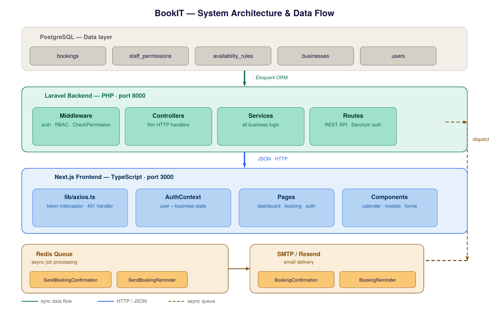
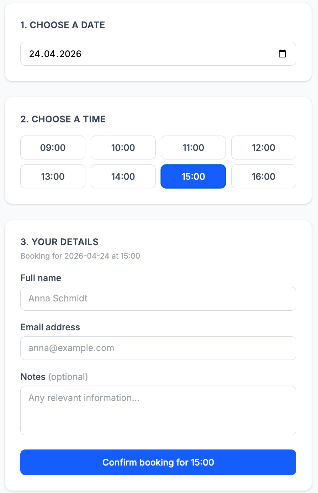
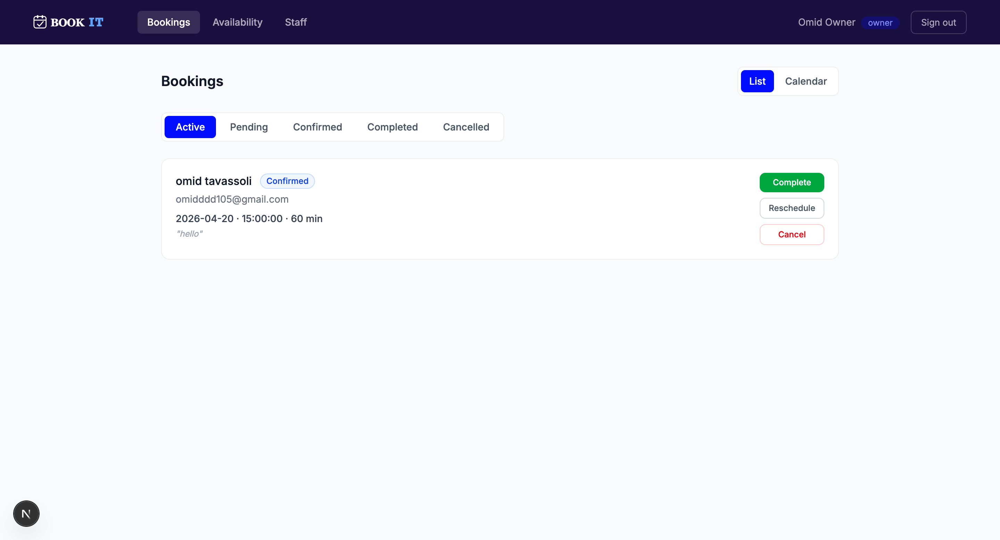
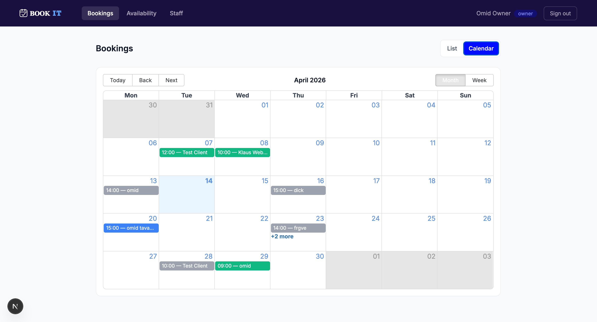
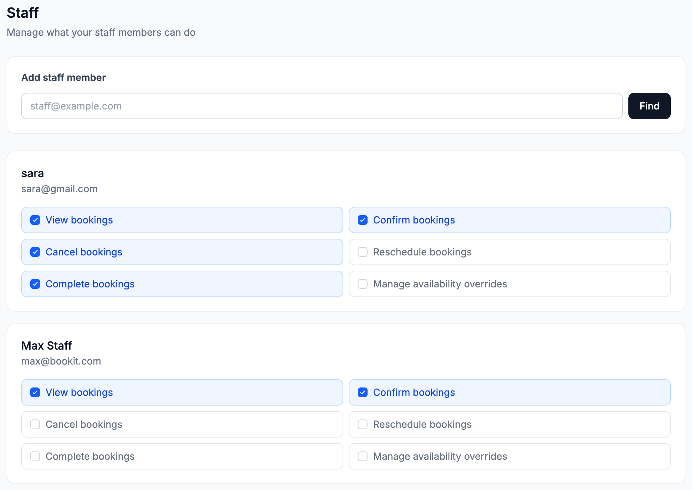

<div align="center">
  
  <br/>
  <br/>
  <p>A full-stack B2B appointment booking system built with Laravel and Next.js.</p>

  
  
  
  
  
  
</div>

---

## Live demo

🔗 **[bookit.omidtavassoli.dev](https://bookit.omidtavassoli.dev)** — deployment in progress

---

## Overview

BookIT allows service businesses — medical practices, consultants, salons — to accept online bookings without a phone call. Businesses get a public booking page at a custom slug, a management dashboard with calendar and list views, and a granular staff permission system that controls exactly what each team member can do.

---

## Tech stack

| Layer | Technologies |
|---|---|
| Backend | Laravel 11, PostgreSQL, Redis, Laravel Sanctum, Laravel Queues |
| Frontend | Next.js 14, TypeScript, Tailwind CSS, Axios, react-big-calendar |
| Infrastructure | Docker, Nginx, Certbot (SSL) |
| Email | Resend (production), Mailpit (local) |

---

## Architecture

The backend follows a strict layered architecture:

```
Routes → Middleware → Controllers → Services → Repositories → Models → PostgreSQL
```

Controllers are thin HTTP handlers — all business logic lives in the service layer. The `CheckPermission` middleware handles owner-or-staff permission checks at the route level, eliminating duplicate routes.



---

## Key features

- **Race-condition-safe scheduling** — PostgreSQL advisory locks prevent double bookings under concurrent load
- **Granular staff permissions** — owners grant per-action permissions (confirm, cancel, reschedule, complete) per staff member via the `staff_permissions` table
- **Async email delivery** — confirmation, acceptance, reschedule, and cancellation emails via Laravel Queues + Redis with automatic retry on failure
- **Full booking lifecycle** — `pending → confirmed → completed` state machine with cancellation and rescheduling at any active stage
- **Dynamic availability** — weekly rules + date-specific overrides. Slots auto-exclude already-booked times at the API level
- **Calendar + list dashboard** — switchable views, status filters, click-to-action booking management
- **No-account public booking** — clients book with name and email only, no registration required
- **Permission-aware UI** — frontend reads staff permissions from the API and shows only permitted action buttons per user

---

## Screenshots

| Public booking page | Owner dashboard |
|---|---|
|  |  |

| Calendar view | Staff management |
|---|---|
|  |  |

---

## Local setup

### Prerequisites

- PHP 8.3, Composer
- Node.js 20+, npm
- PostgreSQL 16
- Redis
- Mailpit (local email testing — `brew install mailpit`)

### Backend

```bash
cd backend
cp .env.example .env
composer install
php artisan key:generate
php artisan migrate
php artisan serve
```

### Queue worker (separate terminal)

```bash
cd backend
php artisan queue:work
```

### Frontend

```bash
cd frontend
npm install
cp .env.local.example .env.local
# Set NEXT_PUBLIC_API_URL=http://127.0.0.1:8000/api
npm run dev
```

Open `http://localhost:3000` — the landing page loads. Register as an owner to access the dashboard. Visit `http://localhost:3000/book/{your-slug}` to see the public booking page.

---

## API overview

Protected by Laravel Sanctum token authentication. Staff routes use a custom `CheckPermission` middleware.

```
POST   /api/register
POST   /api/login
GET    /api/businesses/slug/{slug}             public
GET    /api/businesses/{business}/slots        public
POST   /api/businesses/{business}/bookings     public
GET    /api/businesses/{business}/bookings     permission: view_bookings
PUT    /api/bookings/{booking}/confirm         permission: confirm
PUT    /api/bookings/{booking}/reschedule      permission: reschedule
PUT    /api/bookings/{booking}/complete        permission: complete
DELETE /api/bookings/{booking}                 permission: cancel
GET    /api/businesses/{business}/staff        owner only
POST   /api/businesses/{business}/staff/{user}/permissions   owner only
DELETE /api/businesses/{business}/staff/{user}/permissions/{permission}  owner only
```

---

## Project structure

```
bookit/
├── backend/                  Laravel API
│   ├── app/
│   │   ├── Http/
│   │   │   ├── Controllers/  Thin HTTP handlers
│   │   │   └── Middleware/   Auth, RBAC, CheckPermission
│   │   ├── Services/         All business logic
│   │   ├── Models/           Eloquent models
│   │   └── Jobs/             Queue jobs for email
│   └── routes/api.php
├── frontend/                 Next.js app
│   ├── app/
│   │   ├── page.tsx          Landing page
│   │   ├── dashboard/        Owner + staff dashboard
│   │   ├── book/[slug]/      Public booking page
│   │   ├── login/
│   │   └── register/
│   ├── components/
│   └── lib/                  Axios, Auth, Business contexts
└── docker-compose.yml
```

---

## Author

**Omid Tavassoli** — CS student at TU Darmstadt (5th semester)

[GitHub](https://github.com/omid-tavassoli) · [LinkedIn](https://www.linkedin.com/in/omid-tavassoli-b2758b307)
